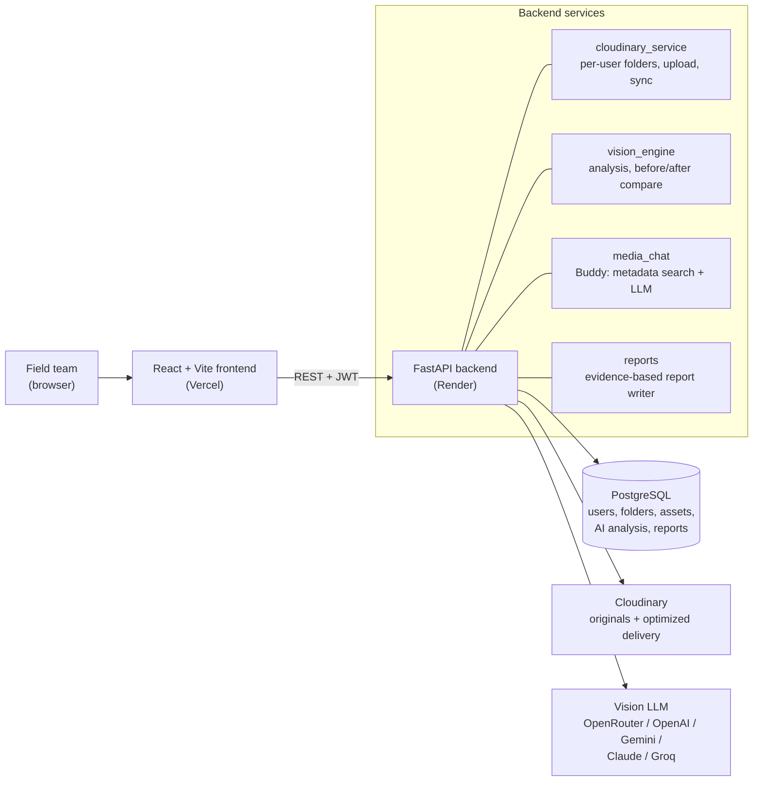

# CloudinaryImpact

An AI-powered impact and sustainability media platform built on Cloudinary.

## The problem

NGOs, governments and sustainability organizations collect huge amounts of photos and videos from their field work: tree planting drives, water projects, solar installations, beach cleanups, community infrastructure and so on. Most of this media ends up scattered across phones, drives and chat groups. Organizing it, checking it, and turning it into evidence and reports for donors is slow manual work, and it doesn't scale.

The challenge was to build a media intelligence platform on Cloudinary that can:

- **Analyze and organize** large collections of field images and videos
- **Detect signals and activities**: which project, what activity, where, and what is visible
- **Compare before and after** media to show visible change
- **Generate impact reports and stories** from the collected evidence
- **Make media searchable** through AI metadata, tags and natural language
- **Preserve traceability** back to the original source assets

The expected outcome is a product that turns raw field media into searchable evidence, measurable impact and stories people actually want to read.

## What I built

I built a web platform where a field team can drop in their photos and get back an organized, searchable library. They can talk to it in plain language, compare before and after photos, and generate reports that link every claim back to the original photo.

The app has six sections:

| Section | What it does |
|---|---|
| **Home** | Explains the workflow and gets people started |
| **Upload** | Drag and drop photos into a project folder, marked as *Before*, *During*, *After* or *General* |
| **Media Library** | Every photo organized by folder, phase and location, with search, filters and a detail view |
| **Buddy** | A chat assistant you can ask things like *"which photos have GPS?"* or *"show me the before photos from the solar site"* |
| **Reports** | Before & after slider with AI change analysis, plus donor, audit or campaign reports |
| **Settings** | Account, AI model choice (System Managed or Bring Your Own Key) and optional own Cloudinary account |

## Architecture

### Frontend

I built the frontend in **React + TypeScript** with **Vite** and **Tailwind CSS**. The navigation bar is floating and rounded, and the home page is animated, with an arc photo gallery, a WebGL shader background and scroll reveals. The frontend never talks to Cloudinary or any AI provider directly. Everything goes through the backend, so no secret ever reaches the browser.

### Backend

The backend is **FastAPI** (async) with **SQLAlchemy** on **PostgreSQL**. I split it into small modules:

- `cloudinary_service.py`: everything Cloudinary: per-user folders, uploads, deletes, sync, delivery URLs
- `storage.py`: decides, per user, which Cloudinary account to use and where their root folder is
- `vision_engine.py` + `llm_client.py`: one client that talks to five AI providers, with vision support
- `media_chat.py`: the brain behind Buddy
- `routers/`: auth, media, AI, reports and settings endpoints

All data is stored **per user**. Every query is scoped to the signed-in account, and every endpoint except sign-up and sign-in requires a valid token. There is no shared demo account.

## How I solved each goal

### 1. Analyze and organize

When someone signs up, I create a **private folder for them in Cloudinary**, like `cloudinary_impact/sarah-jenkins-12`. Every project folder they create and every photo they upload lives inside it, so users never mix.

On upload I:

1. Store the **untouched original** in the user's Cloudinary folder
2. Read the real **EXIF data** from the file: capture time and GPS coordinates. If the camera didn't record them, I leave them empty instead of making something up.
3. Send the image to a **vision model**, which returns a summary, a project category, the detected activity, visual tags and any visible environmental indicators
4. Save everything in PostgreSQL, linked to the user, folder and phase

If a user adds photos to their folder directly from the Cloudinary console, a **Sync** button in the Media Library imports them.

### 2. Signal and activity detection

The vision model reads each photo and returns structured JSON: category (e.g. *Reforestation*, *Clean Water & Sanitation*), activity (e.g. *sapling planting*), visual signals (e.g. `saplings`, `mulch rings`, `field team`) and indicators it can actually see. I prompt it to **only report what is visible** and never invent numbers.

If no AI model is connected, I don't fake it. The photo is saved as *"Not analyzed yet"*, and it can be analyzed later with one click once a key is added.

### 3. Before and after comparison

Photos are marked with a phase when they're uploaded. In **Reports → Before & After**, the user picks a baseline and a follow-up photo and gets an interactive split slider. When they run the analysis, I send **both real images** to the vision model. It describes the visible change, gives an impact score, and lists the change in each metric. Every comparison is saved to the history.

### 4. Impact reports and stories

In **Reports → Impact Report** the user picks a scope (all projects or one folder), an audience and a style:

- **Donor**: warm but factual
- **Audit**: precise and neutral, for M&E teams
- **Campaign**: short and shareable

The report is written **only from the user's real data**: number of assets, phases, categories, geotagged share, capture period, comparisons and AI summaries. The model is told to say *"not yet evidenced"* instead of guessing. Reports can be copied, downloaded as Markdown or printed to PDF.

### 5. Semantic discovery with Buddy

Search in the Media Library covers names, folders, categories, summaries and tags. But the main way to find things is **Buddy**, a chat assistant for your media library.

Here is how Buddy works:

1. It loads the metadata of every asset the user owns
2. It runs a quick keyword and filter pass, understanding things like *before / after*, month and year, *GPS / location* and folder names
3. It sends the question, the library stats and the matching metadata to the AI model, which answers in plain language and returns the IDs of the photos it's talking about
4. The chat shows the answer **with the actual matching thumbnails**, and you can click any of them to ask about that specific photo

If no AI model is available, Buddy still answers from the metadata with rule-based search. It says so openly.

### 6. Traceability

- The **original file is never modified**. Optimized versions (`f_auto`, `q_auto`) and thumbnails are generated as Cloudinary delivery URLs on top of it.
- Every asset keeps its Cloudinary `public_id`, original URL, folder path, EXIF time and GPS
- Every report ends with an **evidence appendix** that links each source photo, with its folder, phase, date and coordinates
- Deleting an asset in the app also deletes it from Cloudinary, so the two never drift apart

## AI: System Managed or Bring Your Own Key

I wanted this to work for a small NGO with zero setup, but also for a government agency that isn't allowed to send data through someone else's account.

- **System Managed** (default): uses the platform's own AI key, so nothing needs to be set up
- **Bring Your Own Key**: the user connects their own **OpenRouter, OpenAI, Gemini, Claude or Groq** key and picks any vision model. Keys are validated with the provider, stored per user, and only ever shown masked.

It's the same idea with storage. By default everyone uses the platform's Cloudinary account, but an organization can connect **its own Cloudinary account** in Settings and keep full ownership of its media.

## Tech stack

| Layer | Tools |
|---|---|
| Frontend | React 18, TypeScript, Vite, Tailwind CSS, lucide-react |
| Backend | FastAPI, SQLAlchemy (async), asyncpg, Pydantic |
| Database | PostgreSQL |
| Media | Cloudinary Upload & Admin APIs, dynamic folders, `f_auto` / `q_auto` delivery |
| AI | OpenRouter, OpenAI, Google Gemini, Anthropic Claude, Groq (vision models) |
| Auth | JWT bearer tokens, bcrypt password hashing |
| Hosting | Vercel (frontend), Render (backend) |
